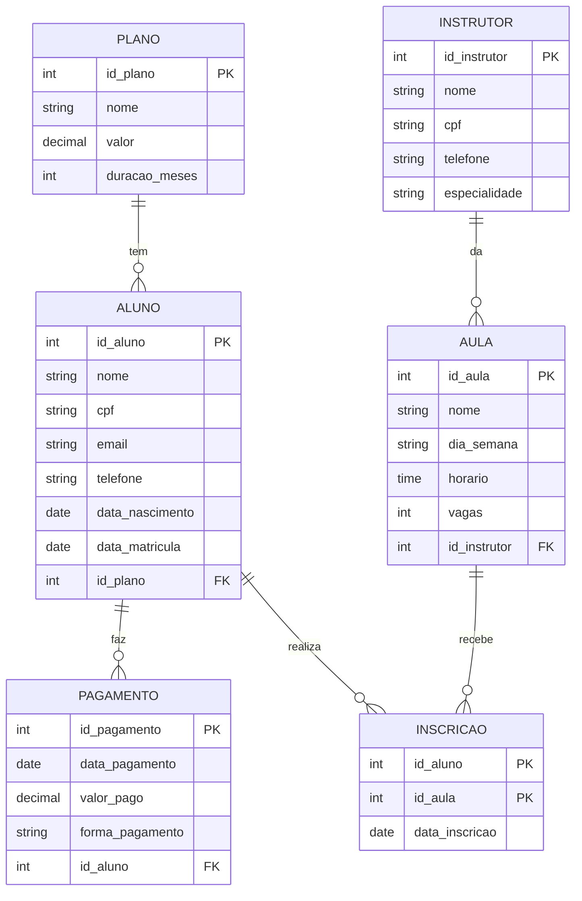

[README.md](https://github.com/user-attachments/files/32445540/README.md)
# Modelagem de Banco de Dados - Academia

Entrega Semana 02

Nome: [seu nome]
Curso: [seu curso]

## Cenário

Continuei com o cenário da **Academia**, o mesmo da semana 01. A academia tem alunos que escolhem um plano e pagam mensalidade, e instrutores que dão aulas (spinning, yoga, zumba...). Os alunos se inscrevem nas aulas que quiserem.

## Entidades

**Entidades fortes** (existem sozinhas, tem PK própria):
- ALUNO
- PLANO
- INSTRUTOR
- AULA
- PAGAMENTO

**Entidade fraca:**
- INSCRICAO: só existe se tiver um aluno e uma aula. Ela surgiu do relacionamento N:N entre ALUNO e AULA, e a chave primária dela é formada pelas chaves das duas (id_aluno + id_aula).

## Atributos

**ALUNO**
- id_aluno (PK)
- nome
- cpf (único)
- email (único)
- telefone
- data_nascimento
- data_matricula
- id_plano (FK)

**PLANO**
- id_plano (PK)
- nome (único)
- valor
- duracao_meses

**PAGAMENTO**
- id_pagamento (PK)
- data_pagamento
- valor_pago
- forma_pagamento
- id_aluno (FK)

**INSTRUTOR**
- id_instrutor (PK)
- nome
- cpf (único)
- telefone
- especialidade

**AULA**
- id_aula (PK)
- nome
- dia_semana
- horario
- vagas
- id_instrutor (FK)

**INSCRICAO**
- id_aluno (PK, FK)
- id_aula (PK, FK)
- data_inscricao

## Relacionamentos

| Relacionamento | Cardinalidade |
|---|---|
| PLANO tem vários ALUNOS | 1:N |
| ALUNO faz vários PAGAMENTOS | 1:N |
| INSTRUTOR dá várias AULAS | 1:N |
| ALUNO faz várias AULAS (e a AULA tem vários ALUNOS) | N:N |

O N:N virou a tabela associativa INSCRICAO, então ficou assim:
- ALUNO 1:N INSCRICAO
- AULA 1:N INSCRICAO

## Diagrama ER (Crow's Foot)

Fiz no Mermaid, o GitHub mostra ele direto aqui.



## Código SQL

O código completo está no arquivo [academia.sql](academia.sql). Usei a sintaxe do MySQL.

As tabelas foram criadas nessa ordem, porque as que tem chave estrangeira precisam que a outra já exista:

1. plano
2. aluno
3. pagamento
4. instrutor
5. aula
6. inscricao

Restrições que usei:
- `PRIMARY KEY` em todas as tabelas (na inscricao é chave composta)
- `FOREIGN KEY` nos relacionamentos
- `NOT NULL` nos campos obrigatórios
- `UNIQUE` no cpf do aluno e do instrutor, no email do aluno e no nome do plano

## Como rodar

No MySQL:

```
mysql -u root -p < academia.sql
```

ou copiar o conteúdo do arquivo e colar no MySQL Workbench.
